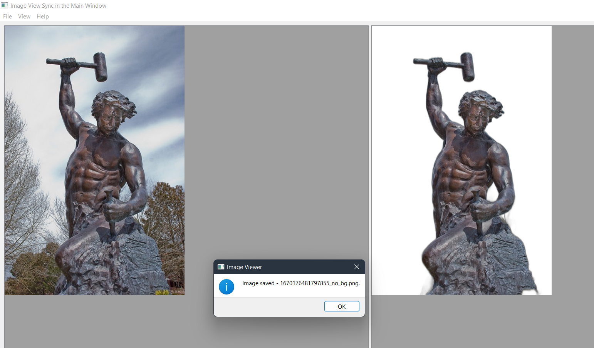

=============
GUI for rembg
=============

A simple PyQT5 GUI for rembg_, a tool to remove images background.

Credits
-------

This package is a slight modification of `Two Image Synchronous Scrolling GitHub gist by acbetter <https://gist.github.com/acbetter/e7d0c600fdc0865f4b0ee05a17b858f2>`_

License
-------
MIT_

.. _rembg: https://github.com/danielgatis/rembg
.. _MIT: https://github.com/vovavili/dota_rosh_timer/blob/master/LICENSE
.. _Code: https://github.com/vovavili/dota_rosh_timer/archive/refs/heads/master.zip
