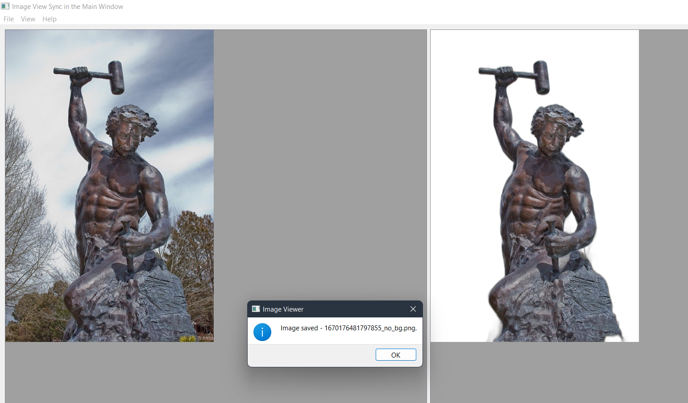

=============
GUI for rembg
=============

A simple PyQt6 GUI for rembg_, a tool to remove image backgrounds.

Python script
-------------

``gui.py`` is the user-facing Python version. It carries its own PEP 723
script metadata, so tools such as uv can create an environment from the script
itself:

.. code-block:: powershell

    uv run gui.py

The inline dependencies use ``rembg[cpu]``. That is the portable default. If
you want CUDA, create your own environment with ``rembg[gpu]`` after your
ONNX Runtime GPU stack is working.

C++ build
---------

The C++/QtWidgets port lives in ``src_cpp/``. It keeps the same two-pane Qt
interface while using ONNX Runtime directly for the U2Net background-removal
step.

Build it with CMake and vcpkg. vcpkg provides Qt; CMake downloads the official
ONNX Runtime binary during configure unless ``ONNXRUNTIME_ROOT`` points at an
already extracted release.

.. code-block:: powershell

    cmake -S . -B build -DCMAKE_BUILD_TYPE=Release -DCMAKE_TOOLCHAIN_FILE=C:\path\to\vcpkg\scripts\buildsystems\vcpkg.cmake
    cmake --build build --config Release
    ctest --test-dir build --output-on-failure
    cmake --install build --config Release --prefix "$PWD\dist\rembg-gui"

The C++ app downloads ``u2net.onnx`` on first use and caches it locally.
Set ``U2NET_HOME`` to choose a different model directory.

Releases
--------

Binary releases publish a Windows x64 zip bundle and a Linux x64 AppImage.
The model file is not bundled; the app downloads and verifies it on first use.
macOS is not part of the release workflow for now.

Credits
-------

This package is a slight modification of `Two Image Synchronous Scrolling GitHub gist by acbetter <https://gist.github.com/acbetter/e7d0c600fdc0865f4b0ee05a17b858f2>`_

License
-------
MIT_

.. _rembg: https://github.com/danielgatis/rembg
.. _MIT: https://github.com/vovavili/rembg_gui/blob/master/LICENSE.md
